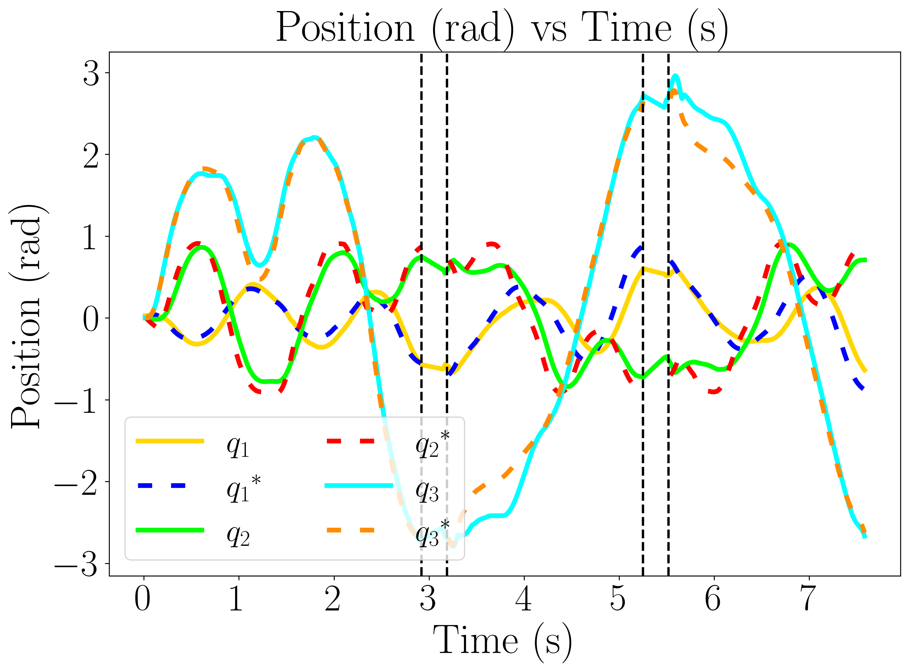
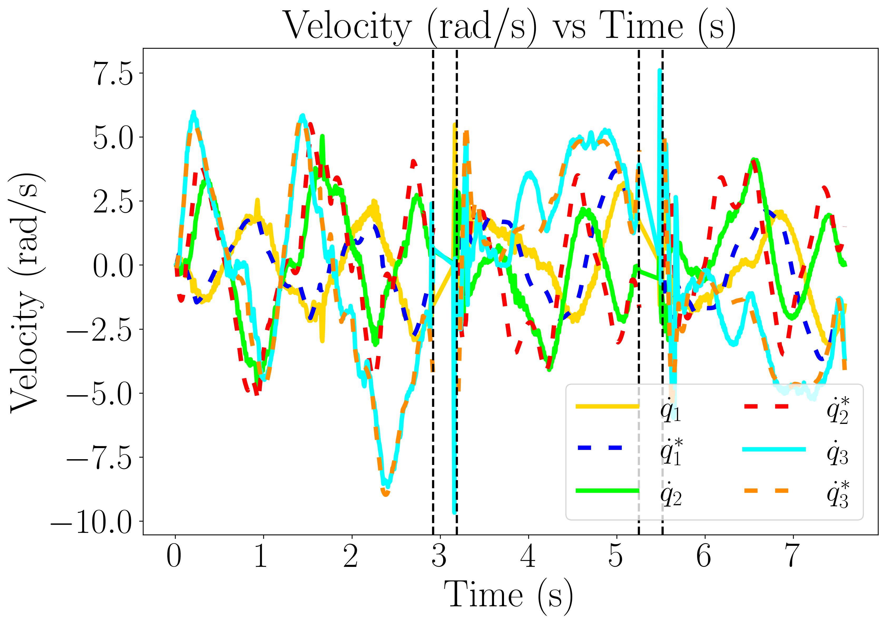
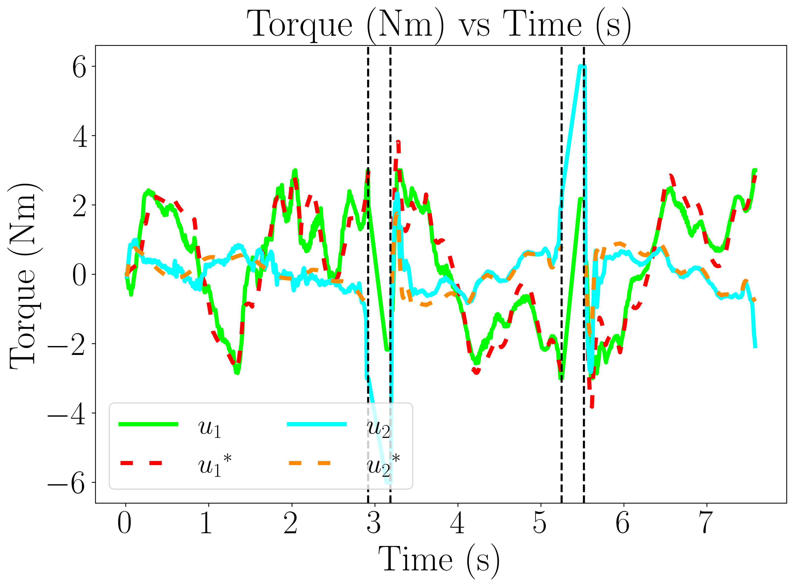
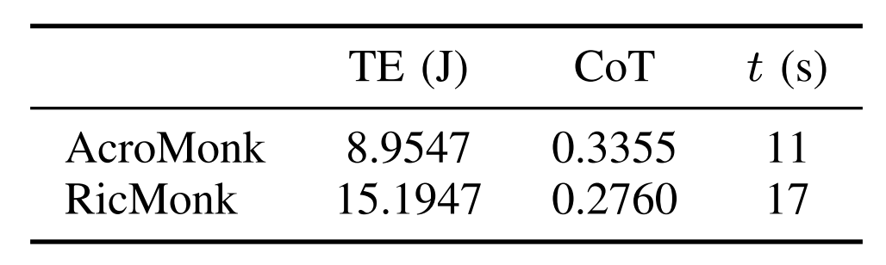
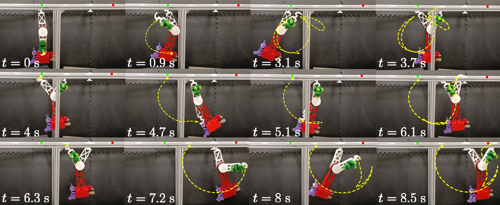

## Introduction
This paper presents the design, analysis, and performance evaluation of RicMonk, a novel three-link brachiation robot equipped with passive hook-shaped grippers. 
Brachiation, an agile and energy-efficient mode of locomotion observed in primates, has inspired the development of RicMonk to explore versatile locomotion and maneuvers on ladder-like structures. 
The robot's anatomical resemblance to gibbons and the integration of a tail mechanism for energy injection contribute to its unique capabilities. 
The paper discusses the use of the Direct Collocation methodology for optimizing trajectories for the robot's dynamic behaviors and stabilization of these trajectories using a Time-varying Linear Quadratic Regulator. 
With RicMonk we demonstrate bidirectional brachiation, and provide comparative analysis with its predecessor, [AcroMonk](https://github.com/dfki-ric-underactuated-lab/acromonk) - a two-link brachiation robot, to demonstrate that the presence of a passive tail helps improve energy efficiency. 
The system design, controllers, and software implementation are publicly available on [GitHub](https://github.com/dfki-ric-underactuated-lab/ricmonk).

## Experimental Results
Javadi *et al.* in [AcroMonk](https://arxiv.org/abs/2305.08373) proposed a state machine to ensure robust and continuous forward or backward brachiation while accounting for potential failures.  RicMonk also employs a similar state machine that integrates *gripper-related heuristics* with a swing phase to generate a maneuver. The swing motion is associated with a sequence of transitions among three fixed configurations, referred to as [*atomic behaviors*](https://github.com/dfki-ric-underactuated-lab/ricmonk/blob/main/software/python/simulation/behavior_generation/trajectory_optimization/README.md).

All the atomic behaviors are [tested with RicMonk](https://youtu.be/hOuDQI7CD8w?t=20) and only continuous backward brachiation is presented here for brevity. 

<figure>
  
  <figcaption>Fig.1 - RicMonk performing continuous backward brachiation</figcaption>
</figure>

## Results and Discussion

<table>
  <tbody>
    <tr align="center" valign="center">
      <td>
        <figure>
          
          <figcaption>Fig.2 - Position plot for backward brachiation</figcaption>
        <figure>
      </td>
      <td>
        </figure>
          
          <figcaption>Fig.3 - Velocity plot for backward brachiation</figcaption>
        </figure>
      </td>
    </tr>
    <tr align="center" valign="center">
      <td>
        <figure>
          
          <figcaption>Fig.4 - Torque plot for backward brachiation</figcaption>
        </figure>
      </td>
      <td>
        <figure>
          
          <figcaption>Table.1 - Comparitive analysis</figcaption>
        </figure>
      </td>
    </tr>
  </tbody>
</table>


Fig.2-4 illusterates presents experimental results of RicMonk performing three consecutive backward brachiation maneuvers (the desired indicated with superscript * and measured positions, velocities, and input torques with solid lines). The plots demonstrate reasonable tracking of desired trajectories resulting in successful brachiation.  

A comparitive analysis is done for AcroMonk and RicMonk and the results are presented in Table.1. Cost of Transport (CoT) is a dimensionless measure for energy efficiency, allowing comparison across sizes and structures. The table highlights several key insights. Though AcroMonk consumes a lot less energy in total, RicMonk has a lower CoT, indicating higher energy efficiency.


The controller's robustness in executing multiple brachiation maneuvers is investigated through several tests, including extra weight, disturbance rejection. In all the scenarios, the controller effectively stabilized the trajectories, enabling RicMonk to perform multiple brachiation maneuvers in two out of three trials. 

<table>
<figure>
  
  <figcaption>Fig.5 - Snapshots of RicMonk performing multiple brachiation motions in the presence of mass uncertainty that is loaded
asymmetrically</figcaption>
<figure>
</table>


<p>
To summarise the work,
<ul>
<li> This paper addressed the mechatronic design, generation, and stabilization of optimal trajectories, and experimental validation of RicMonk, a three-link underactuated brachiation robot, with passive grippers.</li>
<li>  The presence of a tail structure and two actuators help RicMonk to perform multiple brachiation maneuvers in both forward and backward directions and this is a novelty in literature. The presence of the tail also improves the energy efficiency as shown by the comparison of cost of transport</li>
<li> System design and controllers are open-sourced and available online. 
</li>
</ul>
</p>


## Citation
```
@article{2024_ICRA_ricmonk,
  title={RicMonk: A Three-Link Brachiation Robot with Passive Grippers for Energy-efficient Brachiation},
  author={Grama, Shourie S and Javadi, Mahdi and Kumar, Shivesh and Zamani Boroujeni, Hossein and Kirchner, Frank},
  note={Accepted January 29, 2024 in International Conference on Robotics and Automation (ICRA)}}
```