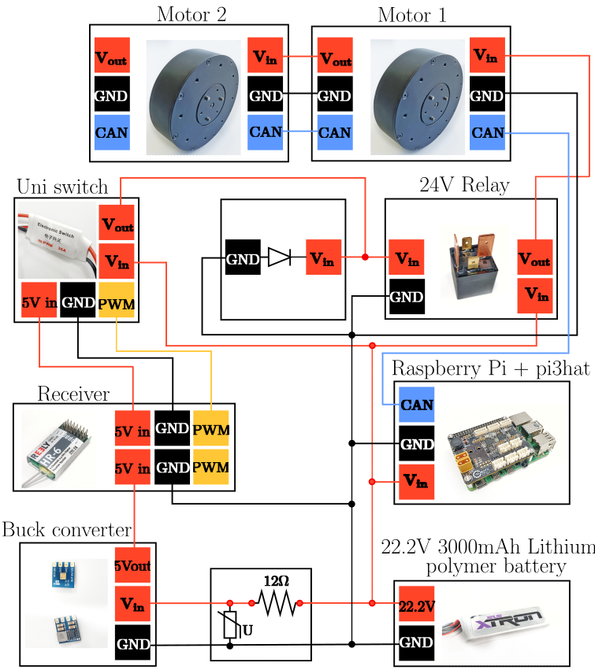

# Mechatronic Design an Integration

## Mechanics
Mechanical Design Optimization and integration of necessary electrical components for a functional, capable, and safe operation of a robotic system constitute the Mechatronic integration of the robot. Inspired by the [AcroMonk](https://arxiv.org/abs/2305.08373), RicMonk was designed to portable and robust. RicMonk, guided by
the concept of interchangeable and reusable components, stands ready to adapt effortlessly to evolving circumstances. From the bio-inspiration perspective, the RicMonk is closer to Gibbons because of the presence of the tail when compared to the AcroMonk. RicMonk’s tail also plays an important role in the robot’s functioning. It not only provides optimal placement of all the electrical components but also helps extensively in helping the robot brachiate.

## Electronics
The schematic of the electrical diagram is shown in the following figure.

### Battery
All electronics of the AcroMonk are powered by a LiPo battery with the following technical data:
- Capacity: $6\text{S}\ 3000 \text{ mAh}$ 
- Voltage: $22.2\text{V}$
- Continuous Discharge: max. $30\text{C } (36\text{A})$
- Burst Discharge:max. $60\text{C } (72\text{A})$
- Power: $26.64 \text{ WH}$

### Raspberry Pi and pi3hat
A Raspberry Pi4B ([setup](../docs/README.md) is used as a processing unit for the robot, and the [mjbots pi3hat](https://mjbots.com/products/mjbots-pi3hat-r4-4b) is used for communication between the Raspberry Pi and the motors. The Inertia Measurement Unit (IMU)([usage](https://github.com/mjbots/pi3hat/blob/master/lib/python/examples/imu_example.py)) on the pi3hat is also used for state estimation purposes. The Raspberry Pi is connected, via WiFi using a Secure Shell Protocol (SSH), to the server that is operated by the user. The Raspberry Pi stores the desired trajectories, the applications to run the robot and help it track trajectories, and measured trajectories.

### Actuator
The actuators used in the RicMonk are the mjbots [qdd100](https://mjbots.com/collections/servos-and-controllers/products/qdd100-beta-3) actuators. These motors are quasi-direct drive motors that provide high torque with sufficient power. These motors also provide the advantages of being back-drivable. 
- [Documentation](https://github.com/mjbots/moteus)
- [Setup](https://www.youtube.com/watch?v=HHCBohdrCH8)

### Emergency Stop
It is necessary to have a safety switch to switch OFF the motors when the robot has an undesired erratic behaviour. To implement the safety switch, a Radio Communication Transmitter Protocol (TX protocol) has been employed to enable a safe operation of the robot. As a result, the electrical circuit includes a transmitter and a receiver. The wiring between the receiver connects to the motors via a 25 A relay, a diode and a 30 A electrical switch. To lower the voltage to the receiver (rated voltage: 6.5 V), a DC-DC converter is used. To avoid the DC-DC converter from getting burnt due to the high frequency voltage fluctuations when the circuit is switched ON, a series combination of a Varistor and a resistor is added to the circuit. This addition dampens the voltage fluctuations in the circuit. As
a result, based on the command from the transmitter, the motors can be directly switched ON and OFF. The electrical switch only controls the functioning of the motors, so the computer (Raspberry Pi) is unaffected by the switching ON and OFF of the motors.

